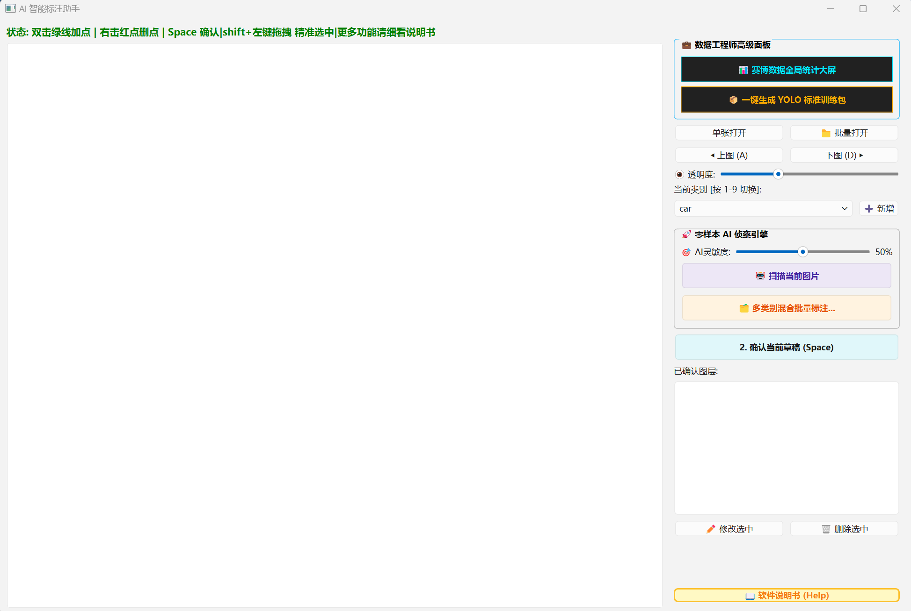

# 🚀 SmartLabeler: AI 智能图像标注平台

[](https://www.python.org/)
[](https://www.qt.io/)
[](https://pytorch.org/)
[]()
[](https://opensource.org/licenses/MIT)

> **"将前沿的视觉大模型技术，转化为开箱即用的工业生产力。"**

<p align="center">
  
</p>

## 📑 软件简介
**SmartLabeler** 是一款融合了 **YOLOv8**（目标检测）与 **Mobile-SAM**（像素级分割）双大模型的图像标注 SaaS 平台。本软件专为高效、精准的计算机视觉数据集制作而生，支持零样本自动标注、多格式批量导出及 YOLO 标准训练包一键构建。

通过建立**单例守护线程架构**与**跨语言内存隔离协议**，本平台实现了零延迟的极客交互体验，彻底告别传统软件拉框描边的低效与卡顿。

---

## 📺 效果演示 (Demo)

> 本项目核心功能的实机运行演示，点击下方视频即可播放：

| 🌟 效果总览：AI 自动标注成品 | 🤖 零样本全图秒扫 |
|:---:|:---:|
| <video src="docs/1.mp4" controls="controls" width="100%" muted></video> | <video src="docs/2.mp4" controls="controls" width="100%" muted></video> |
| *海量图片后台全自动完成高精度像素级抠图与 BBox 定位。* | *YOLO 引导 SAM 实现像素级精准抠图，1秒内完成全图目标的轮廓提取。* |

| 🔪 高级多边形手术刀 | 📊 赛博数据罗盘与导出 |
|:---:|:---:|
| <video src="docs/3.mp4" controls="controls" width="100%" muted></video> | <video src="docs/4.mp4" controls="controls" width="100%" muted></video> |
| *基于解析几何的双击加点与右击删点，像 Photoshop 钢笔工具一样自由修补。* | *实时红黄绿诊断当前数据集健康度，并一键完成 train/val 划分与打包。* |

---

## ✨ 核心黑科技 (Core Features)

1. **零样本双模型联动**：YOLOv8 秒速寻找目标，SAM 瞬间精细抠图。
2. **永生多线程架构**：彻底告别卡顿与闪退，后台默默为您处理海量数据。
3. **一键多类别批量标注**：同时勾选车、人、狗，AI 在后台多线程并发处理整个文件夹，支持 YOLO/VOC/COCO/CSV 五大格式自动去重导出。
4. **高级多边形手术刀**：告别死板的抠图！支持双击绿线动态增加顶点，右击红点瞬间删除毛刺，像 Photoshop 钢笔工具一样随心所欲。
5. **赛博数据全局罗盘**：一键扫描全盘，红黄绿三色进度条直观展示各类别样本占比。样本极度缺乏时自动触发红色警报。
6. **YOLO 标准训练包构建器**：一键将几百张图片按比例（如 8:2）自动打乱并切分为 train/val 集，自动生成完美的 data.yaml。
7. **动态 AI 灵敏度阀门**：首创置信度滑块，拉高防瞎标，拉低防漏标。
8. **极客视觉与图层管理**：支持单独隐藏指定图层，支持全局透明度调节。

---

## 🎮 键鼠操作与快捷键大全 (极客必读)

本软件拥有比肩 Photoshop 的极客操作流，熟练掌握以下快捷键，您的标注效率将提升 10 倍以上：

### 1. 🎯 核心 AI 引导工具 (当全图扫描漏标时使用)
* **`Shift + 鼠标左键拖拽`**：🌟 **框选引导 (BBox Prompt)**。在目标周围拉出一个矩形框，强制引导 SAM 精准抠出该框内的物体。最强人工兜底方式！
* **`Ctrl + 鼠标左键`**：**正向点引导 (Positive Point)**。告诉 AI “这个点属于目标，请抠出来”。
* **`Ctrl + 鼠标右键`**：**负向点引导 (Negative Point)**。告诉 AI “这个点是背景，请剔除”。

### 2. 🔪 高级多边形手术刀 (极限微调绿色草稿)
* **`双击 绿色多边形线条`**：**动态加点**。在点击线条处凭空插入新红点，方便拉出缺失边角。
* **`鼠标右键 点击红点`**：**瞬间删点**。直接删除顶点消除毛刺（系统含安全锁，最少保留3个点防崩溃）。
* **`鼠标左键 拖拽红点`**：**自由变形**。完美贴合复杂物体的绝对边缘。

### 3. ⚡ 流程与视图控制
* **`Space 空格键`**：**确认入库 (Commit)**。将绿色草稿变更为蓝色实体图层并准备写盘。
* **`A 键 / D 键`**：**上一张 / 下一张**。无缝切图，切图瞬间自动执行“坐标去重”并静默保存，绝不丢失数据。
* **`1 ~ 9 数字键`**：极速切换当前目标类别。
* **`Ctrl + Z`**：**撤销 (Undo)**。撤销上一步点/框提示，或删除上一个确认的实体图层。
* **`鼠标滚轮`**：以鼠标指针为中心，丝滑放大/缩小图片。

---

## 🏭 工业级四步工作流 (Workflow)

* **【第 1 步：导入与全图横扫】**
  打开文件夹选择类别（如 car）。点击【🤖 扫描当前图片】，YOLO 雷达瞬间找出所有的车，SAM 切出完美边缘。几百张图可直接点击【🗂️ 多类别混合批量标注】后台挂机处理！
* **【第 2 步：人工抽检与抢救】**
  若 AI 漏标，直接用 `Shift+左键拖拽` 框出来。若边缘有瑕疵，使用手术刀（右键删点/双击加点）微调。确认无误后按 `空格键` 入库。
* **【第 3 步：数据体检大屏】**
  点击【📊 赛博数据全局统计大屏】，系统全局扫描数据，红黄绿三色进度条直观展示类别数量。遇到“⚠️极度缺乏”警报请及时补充图片。
* **【第 4 步：一键打包，直接炼丹】**
  点击【📦 一键生成 YOLO 标准训练包】。输入拆分比例（如 80 代表 8:2），选定空白文件夹，软件自动打乱图片标签，分发至 `train/val` 并生成 `data.yaml`。拿到文件夹即可直接送入大模型训练！

---

## 🧠 底层架构与算法深度 (面试/工程亮点)

* **永生单例线程架构 (Immortal Worker)**：为彻底镇住 PyTorch/OpenMP 的底层算力，废除传统多线程频繁创建销毁机制，设计后台常驻死循环引擎。UI 仅通过 `QMutex` 与 `QWaitCondition` 派发坐标任务，实现 AI 满载运算而 GUI 永远保持 60 帧丝滑不卡顿。
* **跨语言内存隔离盾 (Memory Isolation)**：针对多线程下 C++ 底层连续内存易被 Python GC 回收导致 `0xC0000409` 堆栈溢出崩溃的致命难题，在输出层强制执行 `.copy().tolist()` 内存深度克隆协议，彻底斩断野指针隐患。
* **自适应多边形抽稀算法 (Adaptive Decimation)**：SAM 原始掩码高达数千像素点，直接渲染将致 GUI 卡死。本软件引入 `cv2.approxPolyDP` (RDP算法)，按轮廓周长动态设定 0.2% 容差阈值，将 3000+ 像素点自适应压缩至 30 个关键控制点，渲染压力与导身体积骤降 90% 以上。

---

## 🛠️ 快速开始 (Quick Start)

### 环境依赖
* Python 3.9+
* `torch>=2.0.0`, `torchvision>=0.15.0`, `ultralytics>=8.0.0`, `PyQt6>=6.4.0`, `opencv-python>=4.7.0`

### 部署指令
```bash
# 1. 克隆仓库
git clone [https://github.com/katiacoco/SmartLabeler.git](https://github.com/katiacoco/SmartLabeler.git)
cd SmartLabeler

# 2. 安装依赖
pip install -r requirements.txt

# 3. 启动平台
python main.py

*(注：核心预训练权重 `yolov8n.pt` 与 `mobile_sam.pt` 已内置于本仓库，无需配置额外网络环境，真正做到开箱即用。建议配备 NVIDIA GPU 以获得极速推理体验。)*